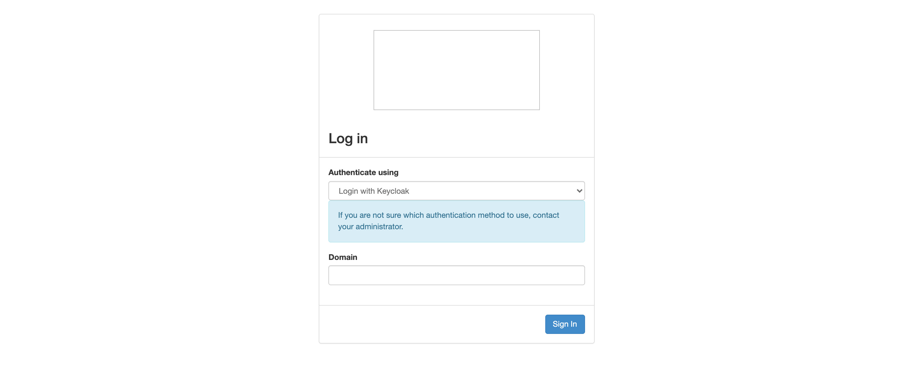
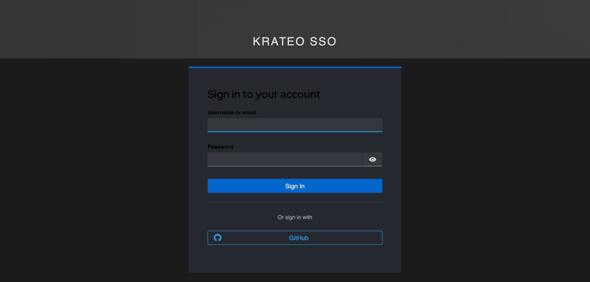
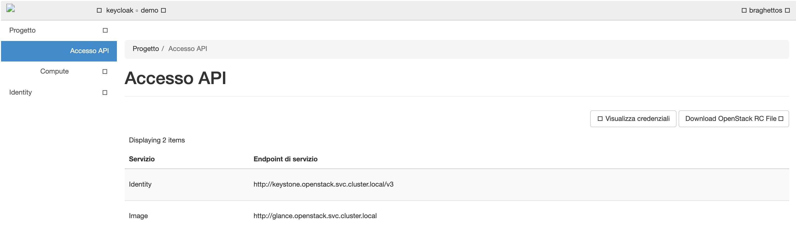

# Live walkthrough: GitHub → Keycloak → Keystone → Horizon, all GitOps-native

This quickstart reproduces, on a **real GKE cluster**, a full single-sign-on chain
where a user authenticates with their **GitHub** account and lands — already logged
in — on the **OpenStack Horizon** dashboard, scoped into an OpenStack project.

Every hop is declared as a Kubernetes Custom Resource reconciled by a Krateo
Operator Generator (KOG). Nothing in the identity or federation setup is created by
`kcadm.sh`, the `openstack` CLI, or the Keystone/Keycloak admin UIs.

```
GitHub  ──▶  Keycloak (krateo realm)  ──▶  Keystone (OIDC federation)  ──▶  Horizon
 OAuth        broker + client + mapper        IdP + mapping + protocol      WebSSO
   │                    │                              │                       │
   │            Keycloak Operator +            openstack-keystone-        openstack-helm
   │            keycloak-config-kog            operator-kog (KOG)          Helm values
   │                 (KOG)                                                      │
   └──────────────── all reconciled from CRs / Helm values in Git ─────────────┘
```

The chain was validated end-to-end on GKE cluster `osh-sso`
(`europe-west1-b`, 1× `e2-standard-16`). Federated user `braghettos` (a GitHub
account) logs in and is auto-provisioned into the `demo` OpenStack project with the
`member` role.

> **Two roles of the two KOGs.** The **Keycloak** KOG manages *authentication*
> (realm, clients, brokered identity providers, protocol mappers). The **Keystone**
> KOG manages *identity and federation trust* (projects, domains, roles, **and** the
> `OS-FEDERATION` identity-provider / mapping / protocol objects). Keystone's
> `mod_auth_openidc` wiring lives in the Helm chart values — it is Apache config, not
> an API object.

---

## 0. Prerequisites

- A running Kubernetes cluster with a `LoadBalancer` provider (this guide uses GKE).
- `kubectl`, `helm` (v3), and access to the cluster.
- The Krateo `oasgen-provider` + `rest-dynamic-controller` (installed by each KOG chart).
- A custom Keystone image that bundles `mod_auth_openidc` (the stock
  `airshipit/keystone` image does not ship it — see §3).
- A GitHub account to log in with.

Throughout, three externally-reachable hostnames are used (nip.io wildcard DNS over
the LoadBalancer IPs). Substitute your own:

| Component | URL used in this guide |
|-----------|------------------------|
| Keycloak  | `http://34.38.33.102.nip.io` |
| Keystone  | `http://34.34.171.168.nip.io:5000` |
| Horizon   | `http://34.79.235.209` |

---

## 1. GitHub OAuth App (the only click-ops step)

GitHub does not expose a create-OAuth-App API for third parties, so this is done once
in the GitHub UI (**Settings → Developer settings → OAuth Apps → New**):

- **Homepage URL:** `http://34.38.33.102.nip.io`
- **Authorization callback URL:**
  `http://34.38.33.102.nip.io/realms/krateo/broker/github/endpoint`

Note the generated **Client ID** and **Client secret**; they feed the Keycloak
GitHub broker in §2.

Everything after this point is declarative.

---

## 2. Keycloak: realm, Keystone client, and the GitHub broker (KOG)

Install the Keycloak Operator blueprint (lifecycle) and the `keycloak-config-kog`
(config) — see [`keycloak-operator-blueprint`](./keycloak-operator-blueprint/) and
[`keycloak-config-kog`](./keycloak-config-kog/). Then apply the realm and the
Keystone client.

### 2a. Realm + Keystone OIDC client

```yaml
# osh-sso-values/realm.yaml (excerpt)
apiVersion: keycloak.ogen.krateo.io/v1alpha1
kind: KeycloakRealm
metadata:
  name: krateo
  namespace: krateo-system
spec:
  configurationRef:
    name: keycloak-admin
    namespace: krateo-system
  realm: krateo
  enabled: true
  displayName: "Krateo SSO"
  sslRequired: none
  loginWithEmailAllowed: true
---
apiVersion: keycloak.ogen.krateo.io/v1alpha1
kind: KeycloakClient
metadata:
  name: keystone
  namespace: krateo-system
spec:
  configurationRef:
    name: keycloak-admin
    namespace: krateo-system
  realm: krateo
  clientId: keystone
  name: "OpenStack Keystone"
  enabled: true
  protocol: openid-connect
  publicClient: false
  standardFlowEnabled: true
  clientAuthenticatorType: client-secret
  redirectUris:
    - "http://34.34.171.168.nip.io:5000/*"
  protocolMappers:
    - name: groups
      protocol: openid-connect
      protocolMapper: oidc-group-membership-mapper
      config:
        "claim.name": "groups"
        "full.path": "false"
        "access.token.claim": "true"
        "id.token.claim": "true"
        "userinfo.token.claim": "true"
```

### 2b. GitHub as a brokered Identity Provider

The GitHub OAuth App from §1 is declared as a `KeycloakIdentityProvider`, and a
`KeycloakIdentityProviderMapper` drops every GitHub user into a Keycloak group. See
[`keycloak-config-kog/demo/github-sso/`](./keycloak-config-kog/demo/github-sso/) for
the full manifests (`10-github-idp.yaml`). Key points learned the hard way:

- The GitHub broker `alias` must match the OAuth callback path (`.../broker/github/endpoint`).
- Use `oidc-hardcoded-group-idp-mapper` (not `hardcoded-group-idp-mapper`) — the
  non-`oidc-` variant NPEs under a `keycloak-oidc` broker.
- The mapper body must include `identityProviderAlias`, or Keycloak returns 409.

After this, browsing to Keycloak shows a **"Login with Keycloak"** account page with a
**GitHub** button.

---

## 3. Keystone: OIDC Relying Party via `mod_auth_openidc` (Helm values)

Keystone trusts the Keycloak realm at the Apache layer. The stock
`quay.io/airshipit/keystone` image lacks the module, so a one-line derived image is
used:

```dockerfile
FROM quay.io/airshipit/keystone:2025.1-ubuntu_jammy
RUN apt-get update && apt-get install -y libapache2-mod-auth-openidc \
    && rm -rf /var/lib/apt/lists/*
```

Published to `gcr.io/integration-test-431120/keystone-oidc:2025.1-ubuntu_jammy` and
referenced in the Keystone Helm values:

```yaml
# osh-sso-values/keystone-federation.yaml (excerpt)
images:
  tags:
    keystone_api: gcr.io/integration-test-431120/keystone-oidc:2025.1-ubuntu_jammy
conf:
  keystone:
    auth:
      methods: password,token,openid
    openid:
      remote_id_attribute: HTTP_OIDC_ISS
    federation:
      trusted_dashboard:
        - http://34.79.235.209/auth/websso/
  software:
    apache2:
      a2enmod:
        - auth_openidc          # NB: 'headers' fails on the read-only rootfs
  wsgi_keystone: |
    ...
    OIDCScope "openid email profile"   # NOT "...groups" — Keycloak has no 'groups' scope
    OIDCProviderMetadataURL http://34.38.33.102.nip.io/realms/krateo/.well-known/openid-configuration
    OIDCClientID keystone
    OIDCClientSecret <keystone client secret>
    OIDCRedirectURI http://34.34.171.168.nip.io:5000/v3/auth/OS-FEDERATION/identity_providers/keycloak/protocols/openid/redirect_uri
    ...
```

Gotchas validated live: disable the `service_ingress_api` / `ingress_api` /
`secret_ingress_tls` manifests if your `helm-toolkit` version doesn't ship them; and
`kubectl delete jobs -l application=keystone` before a `helm upgrade` (bootstrap Jobs
are immutable).

---

## 4. Keystone federation trust, KOG-native

This is the part that used to be hand-run with `openstack federation ...` CLI. It is
now three CRs reconciled by the **Keystone KOG**
([`openstack-keystone-operator-kog`](https://github.com/braghettos/openstack-keystone-operator-kog)):

- **`IdentityFederationProvider`** — the trusted IdP (Keycloak's realm issuer).
- **`IdentityMapping`** — the OIDC-claims → Keystone-user/project rules.
- **`IdentityFederationProtocol`** — binds the `openid` protocol on the IdP to the mapping.

Plus the target domain and project, also KOG-managed (`IdentityDomain`,
`IdentityProject`). See [`chart/samples/federation.yaml`](https://github.com/braghettos/openstack-keystone-operator-kog/blob/main/chart/samples/federation.yaml).

```yaml
apiVersion: identity.openstack.krateo.io/v1alpha1
kind: IdentityFederationProvider
metadata:
  name: keycloak
  namespace: krateo-system
spec:
  configurationRef:
    name: keystone-config
    namespace: krateo-system
  id: keycloak
  identity_provider:
    enabled: true
    description: "Keycloak (krateo realm) OIDC identity provider"
    # Pin the IdP to the KOG-managed `keycloak` domain (its IdentityDomain status.id).
    # Without this, Keystone auto-creates a per-IdP domain and auto-provisioned
    # projects land there — disconnected from your KOG-managed domain.
    domain_id: "<keycloak IdentityDomain id>"
    remote_ids:
      - "http://34.38.33.102.nip.io/realms/krateo"
---
apiVersion: identity.openstack.krateo.io/v1alpha1
kind: IdentityMapping
metadata:
  name: keycloak-mapping
  namespace: krateo-system
spec:
  configurationRef:
    name: keystone-config
    namespace: krateo-system
  id: keycloak_mapping
  mapping:
    rules:
      - local:
          - user:
              name: "{0}"
              domain:
                name: keycloak
          - projects:
              # No `domain` here — Keystone rejects it; the project's domain is
              # inferred from the `user` domain above.
              - name: demo
                roles:
                  - name: member
        remote:
          - type: OIDC-preferred_username
---
apiVersion: identity.openstack.krateo.io/v1alpha1
kind: IdentityFederationProtocol
metadata:
  name: keycloak-openid
  namespace: krateo-system
spec:
  configurationRef:
    name: keystone-config
    namespace: krateo-system
  idp_id: keycloak
  id: openid
  protocol:
    mapping_id: keycloak_mapping
```

Apply and wait for all three to reconcile:

```bash
kubectl get identityfederationproviders,identitymappings,identityfederationprotocols \
  -n krateo-system
# NAME                                                          READY
# identityfederationprovider.identity.openstack.krateo.io/keycloak   True
# identitymapping.identity.openstack.krateo.io/keycloak-mapping      True
# identityfederationprotocol.identity.openstack.krateo.io/keycloak-openid True
```

### Federation KOG gotchas (validated live)

| Symptom | Cause | Fix |
|---------|-------|-----|
| `400 "'domain' was unexpected"` on the mapping | `domain` inside the `projects` local rule | Remove it; project domain is inferred from the `user` rule |
| `409 Conflict` on any update | Keystone `PUT /OS-FEDERATION/.../{id}` is **create-only** | RD `update` verb uses **PATCH** (with a matching `patch` op in the OpenAPI asset) |
| Duplicate `demo` project; user can't scope | IdP got an auto-created per-IdP domain | Set `identity_provider.domain_id` to the managed domain → auto-provisioning **reuses** the KOG project |
| `409 "store federated_user - Duplicate entry"` after recreating the IdP | Stale shadow users from the old IdP | Delete shadow users in the federation domain, then re-login |

---

## 5. Horizon: WebSSO

Horizon offers the Keycloak login and trusts the Keystone WebSSO callback:

```yaml
# osh-sso-values/horizon-values.yaml (excerpt)
conf:
  horizon:
    local_settings:
      config:
        auth:
          sso:
            enabled: true
            initial_choice: "openid"
            websso_keystone_url: "http://34.34.171.168.nip.io:5000/v3"
          idp_mapping:
            - name: openid
              label: "Login with Keycloak"
              idp: keycloak
              protocol: openid
```

---

## 6. Log in

1. Open Horizon → the login page shows **Authenticate using: Login with Keycloak**. Click **Sign In**.
   
2. You are redirected to Keycloak's **KRATEO SSO** page. Click **GitHub**.
   
3. GitHub prompts to authorize the OAuth App **on first login only**, then redirects
   back (later logins skip straight through — the grant is remembered).
4. Keycloak brokers the identity, Keystone federates it (auto-provisioning the user
   into the `demo` project), and Horizon drops you on the dashboard as your GitHub
   user, scoped to **`keycloak • demo`**.
   

> **First-panel note.** Horizon's WebSSO lands with a *domain-scoped* token, so the
> default Compute Overview panel shows "not authorized". Pick the project in the
> top-left switcher ("Switch to project demo") to rescope to a *project* token — panels
> then render. (On a minimal identity+image deployment the Compute Overview will still
> be empty; use **API Access** or **Images** to confirm the session.)

Verify the federation result from the CLI:

```bash
# The shadow user exists in the keycloak domain and holds `member` on the KOG demo project
openstack role assignment list --names --user <user> --user-domain keycloak
# +--------+---------------------+... 
# | member | braghettos@keycloak | demo@keycloak ...
```

---

## What is (and isn't) declarative

| Hop | How it's declared | Repo |
|-----|-------------------|------|
| GitHub OAuth App | Manual (no API) — one-time | github.com |
| Keycloak realm / client / GitHub broker / mappers | **CRs** (Keycloak KOG) | `keycloak-config-kog` |
| Keystone `mod_auth_openidc` | Helm values (Apache config) | `osh-sso-values` |
| Keystone IdP / mapping / protocol / domain / project | **CRs** (Keystone KOG) | `openstack-keystone-operator-kog` |
| Horizon WebSSO | Helm values | `osh-sso-values` |

The only imperative step is registering the GitHub OAuth App, which has no public API.
Everything else lives in Git and reconciles continuously.
