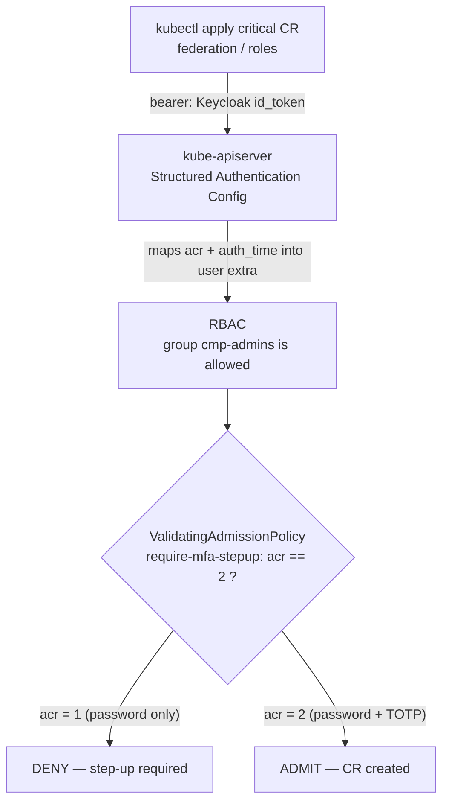
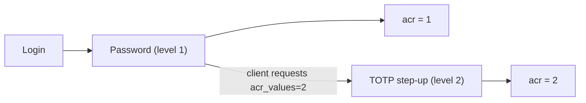

# Quickstart — MFA step-up for critical Kubernetes operations (Keycloak + admission policy)

Enforce **MFA step-up at the moment of a critical operation**: applying a sensitive
Custom Resource (federation / role management) is rejected unless the caller's OIDC
token was **stepped up with a second factor** (`acr=2`). A password-only session is
denied; a token minted after TOTP is admitted.

This runs fully locally on **kind** + a dockerized **Keycloak** (needed because the
mechanism configures the kube-apiserver's authentication and an HTTPS OIDC issuer —
not possible on a managed control plane like GKE/EKS/AKS).



## Prerequisites

`docker`, `kind` (≥ 0.20), `kubectl` (**≥ 1.30** for Structured Auth + ValidatingAdmissionPolicy GA), `jq`, `openssl`, `python3`.

Set a working dir:

```bash
export D=$PWD/demo-mfa-stepup && mkdir -p $D/certs $D/manifests $D/scripts && cd $D
```

---

## 1. TLS for Keycloak (the apiserver requires an HTTPS issuer)

```bash
cd $D/certs
openssl req -x509 -newkey rsa:2048 -nodes -keyout ca.key -out ca.crt -days 365 -subj "/CN=cmp-mfa-demo-ca"
openssl req -newkey rsa:2048 -nodes -keyout kc.key -out kc.csr -subj "/CN=keycloak"
printf 'subjectAltName=DNS:keycloak,DNS:localhost,IP:127.0.0.1\nextendedKeyUsage=serverAuth\n' > san.cnf
openssl x509 -req -in kc.csr -CA ca.crt -CAkey ca.key -CAcreateserial -out kc.crt -days 365 -extfile san.cnf
cd $D
```

## 2. kube-apiserver Structured Authentication Config

Maps Keycloak claims into the user identity — crucially, `acr` and `auth_time` into
`extra`, where the admission policy can read them.

```bash
CA_INDENT=$(sed 's/^/        /' certs/ca.crt)
cat > manifests/auth-config.yaml <<EOF
apiVersion: apiserver.config.k8s.io/v1beta1
kind: AuthenticationConfiguration
jwt:
  - issuer:
      url: https://keycloak:8443/realms/cmp
      audiences: [kubernetes]
      certificateAuthority: |
$CA_INDENT
    claimMappings:
      username: { claim: preferred_username, prefix: "oidc:" }
      groups:   { claim: groups, prefix: "oidc:" }
      extra:
        - key: "cmp.krateo.io/acr"
          valueExpression: "has(claims.acr) ? claims.acr : 'none'"
        - key: "cmp.krateo.io/auth_time"
          valueExpression: "has(claims.auth_time) ? string(int(claims.auth_time)) : '0'"
EOF
```

> The two `{ ... }` above are inside a CEL/JSON context, not YAML data — the CRs later
> use block style. (Keep JSON out of your *resource* YAML.)

## 3. kind cluster wired to that config

```bash
cat > manifests/kind-config.yaml <<EOF
kind: Cluster
apiVersion: kind.x-k8s.io/v1alpha4
name: cmp-mfa
nodes:
  - role: control-plane
    extraMounts:
      - hostPath: $D/manifests/auth-config.yaml
        containerPath: /etc/kubernetes/auth/auth-config.yaml
        readOnly: true
    kubeadmConfigPatches:
      - |
        kind: ClusterConfiguration
        apiServer:
          extraArgs:
            authentication-config: /etc/kubernetes/auth/auth-config.yaml
          extraVolumes:
            - name: auth-config
              hostPath: /etc/kubernetes/auth
              mountPath: /etc/kubernetes/auth
              readOnly: true
              pathType: DirectoryOrCreate
EOF
kind create cluster --config manifests/kind-config.yaml --image kindest/node:v1.32.2 --wait 120s
```

> The apiserver starts fine even though Keycloak isn't up yet — OIDC discovery is lazy
> and retried.

## 4. Keycloak (TLS, on the kind network)

Runs on the `kind` docker network with alias `keycloak`, so the apiserver reaches
`https://keycloak:8443`; port 8443 is published so you can mint tokens from the host.

```bash
docker run -d --name keycloak --network kind --network-alias keycloak -p 8443:8443 \
  -v $D/certs/kc.crt:/certs/kc.crt:ro -v $D/certs/kc.key:/certs/kc.key:ro \
  -e KC_BOOTSTRAP_ADMIN_USERNAME=admin -e KC_BOOTSTRAP_ADMIN_PASSWORD=admin \
  -e KC_HOSTNAME=https://keycloak:8443 \
  -e KC_HTTPS_CERTIFICATE_FILE=/certs/kc.crt -e KC_HTTPS_CERTIFICATE_KEY_FILE=/certs/kc.key \
  quay.io/keycloak/keycloak:26.0 start-dev
# wait for readiness
until curl -sf --resolve keycloak:8443:127.0.0.1 --cacert certs/ca.crt \
  https://keycloak:8443/realms/master/.well-known/openid-configuration >/dev/null; do sleep 3; done
```

## 5. Keycloak realm: client, user + TOTP, and the LoA step-up flow



Create the `cmp` realm and the public `kubernetes` client (standard + direct-access
grants, redirect `http://localhost:8000`) with a **groups** mapper, then run the
bundled scripts to seed the user + build the step-up flow:

```bash
docker exec keycloak /opt/keycloak/bin/kcadm.sh config credentials \
  --server http://localhost:8080 --realm master --user admin --password admin
docker exec keycloak /opt/keycloak/bin/kcadm.sh create realms -s realm=cmp -s enabled=true
docker exec keycloak /opt/keycloak/bin/kcadm.sh create clients -r cmp \
  -s clientId=kubernetes -s publicClient=true -s standardFlowEnabled=true \
  -s directAccessGrantsEnabled=true -s 'redirectUris=["http://localhost:8000","http://localhost:8000/*"]'
# groups mapper on the client (claim "groups")
CID=$(docker exec keycloak /opt/keycloak/bin/kcadm.sh get clients -r cmp -q clientId=kubernetes --fields id --format csv --noquotes | tail -1)
docker exec keycloak /opt/keycloak/bin/kcadm.sh create clients/$CID/protocol-mappers/models -r cmp \
  -s name=groups -s protocol=openid-connect -s protocolMapper=oidc-group-membership-mapper \
  -s 'config."claim.name"=groups' -s 'config."full.path"=false' \
  -s 'config."id.token.claim"=true' -s 'config."access.token.claim"=true'
docker exec keycloak /opt/keycloak/bin/kcadm.sh create groups -r cmp -s name=cmp-admins

bash scripts/30-seed-user-otp.sh   # alice: password + seeded TOTP secret + cmp-admins
bash scripts/31-loa-flow.sh        # build LoA browser flow (L1 password / L2 OTP)
bash scripts/32-loa-wire.sh        # set requirements + LoA configs, bind flow to client
```

**Second factor:** this uses **TOTP** (authenticator-app codes) — built-in, no gateway.
`scripts/totp.py` reproduces Keycloak's TOTP so the demo runs non-interactively. Swapping
to **WebAuthn/passkeys** is a Keycloak-flow change only; the cluster policy is unaffected.

## 6. The gate: CRDs + RBAC + the ValidatingAdmissionPolicy

`manifests/cluster.yaml` installs the critical CRDs, grants the `cmp-admins` group
RBAC over them, and applies the step-up policy:

```yaml
apiVersion: admissionregistration.k8s.io/v1
kind: ValidatingAdmissionPolicy
metadata:
  name: require-mfa-stepup
spec:
  failurePolicy: Fail
  matchConstraints:
    resourceRules:
      - apiGroups: ["identity.openstack.krateo.io"]
        apiVersions: ["*"]
        operations: ["CREATE", "UPDATE", "DELETE"]
        resources:
          - identityfederationproviders
          - identitymappings
          - identityfederationprotocols
          - identityroles
          - identityroleassignments
  matchConditions:
    - name: only-oidc-users
      expression: "has(request.userInfo.username) && request.userInfo.username.startsWith('oidc:')"
  variables:
    - name: acr
      expression: "('cmp.krateo.io/acr' in request.userInfo.extra) ? request.userInfo.extra['cmp.krateo.io/acr'][0] : 'none'"
  validations:
    - expression: "variables.acr == '2'"
      messageExpression: "'CMP critical operation on ' + request.resource.resource + ' requires MFA step-up (acr=2). Your token has acr=' + variables.acr + '.'"
```

```bash
kubectl apply -f manifests/cluster.yaml
```

## 7. DENY — password-only token

```bash
SRV=$(kubectl config view --raw -o jsonpath='{.clusters[?(@.name=="kind-cmp-mfa")].cluster.server}')
kubectl config view --raw -o jsonpath='{.clusters[?(@.name=="kind-cmp-mfa")].cluster.certificate-authority-data}' | base64 -d > certs/kind-ca.crt
IDT=$(curl -s --resolve keycloak:8443:127.0.0.1 --cacert certs/ca.crt \
  https://keycloak:8443/realms/cmp/protocol/openid-connect/token \
  -d grant_type=password -d client_id=kubernetes -d username=alice -d password=alice -d scope=openid | jq -r .id_token)
KUBECONFIG=/dev/null kubectl --server="$SRV" --certificate-authority=certs/kind-ca.crt \
  --token="$IDT" apply -f manifests/sample-cr.yaml
```
```
Error ... ValidatingAdmissionPolicy 'require-mfa-stepup' denied request:
CMP critical operation on identityfederationproviders requires MFA step-up (acr=2).
Your token has acr=1.
```

## 8. ALLOW — after TOTP step-up

```bash
bash scripts/50-mint-gold-token.sh   # scripted password → TOTP login → writes /tmp/gold_idt.txt (acr=2)
KUBECONFIG=/dev/null kubectl --server="$SRV" --certificate-authority=certs/kind-ca.crt \
  --token="$(cat /tmp/gold_idt.txt)" apply -f manifests/sample-cr.yaml
```
```
identityfederationprovider.identity.openstack.krateo.io/keycloak created
```

`kubectl ... auth whoami` with the two tokens shows the difference the policy keys on:
`Extra: cmp.krateo.io/acr [1]` vs `[2]`.

## 9. Cleanup

```bash
kind delete cluster --name cmp-mfa
docker rm -f keycloak
```

---

## Notes

- **Freshness** ("at the moment of"): add `now - auth_time < N min` to the policy —
  `auth_time` is already mapped to `extra` (the browser step-up token carries it;
  direct-grant tokens don't).
- **Scope**: `matchConstraints` targets only the sensitive kinds; everything else is
  untouched. `only-oidc-users` exempts controllers/ServiceAccounts and the break-glass
  cert admin.
- **Interactive pop-up UX** (step-up *on the click*) belongs in the CMP portal/API,
  which redirects to Keycloak with `acr_values=2`. This admission gate is the
  defense-in-depth for direct `kubectl`.
