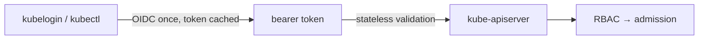
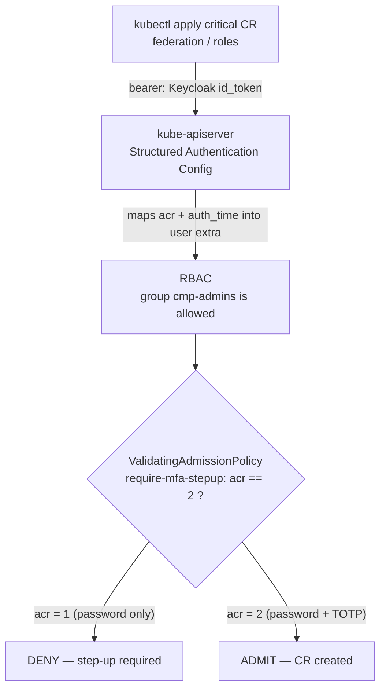
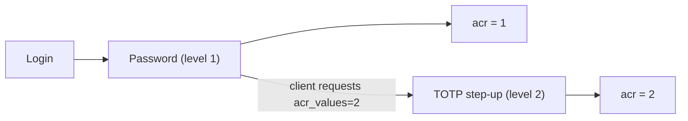

# Step-Up MFA for `kubectl`: Making Kubernetes Demand a Second Factor Before Critical Operations

*MFA at login is table stakes. The hard requirement is step-up — forcing a fresh second factor at the moment of a sensitive action — and making it hold for people applying Custom Resources with `kubectl`. Here's how I did it with Keycloak's `acr` claim and a ValidatingAdmissionPolicy, on a real cluster.*


---

## The requirement that sounds simple

A cloud-management-platform security requirement landed on my desk:

> The CMP must enforce MFA for administrative access, and must be able to require **MFA step-up at the moment of critical operations** (role management, federation management, usage export).

The first half is easy. Every IdP worth the name can require a second factor at login. It's the second half that's interesting: **step-up** — not "were you MFA'd at some point today," but "prove a second factor *right now*, because you're about to do something dangerous."

And in a Krateo/GitOps world, "something dangerous" often means `kubectl apply` of a Custom Resource — a federation trust, a role binding. So the sharp version of the requirement is:

> Applying a critical CR must require an MFA-stepped-up session. A password-only session is refused.

## Why the obvious approach doesn't exist

Keycloak has proper step-up (Level of Authentication). A web app redirects the user back to Keycloak with `acr_values=<high>`, Keycloak prompts for *only the missing factor*, and returns a token stamped with a higher `acr`. Textbook — **for interactive OIDC clients**.

`kubectl → kube-apiserver` is not that.



The apiserver **statelessly validates a JWT**. There's no channel to pause an `apply`, bounce the human to Keycloak for a fingerprint, and resume. So "interactive step-up at the moment of `kubectl apply`" is architecturally impossible at that layer.

> The apiserver can't *prompt*. But it can *refuse* — based on what the token already proves.

That reframes step-up on `kubectl` from an interactive pop-up into a **policy gate**: the token must already carry proof that a second factor was used. If it doesn't, deny — and the human re-authenticates with step-up and retries. Out-of-band, but it enforces the exact security property: *no critical CR without a fresh MFA.*

(The interactive pop-up still exists — it lives in the CMP portal/API, which *is* an OIDC client and can trigger `acr_values`. This article is about the defense-in-depth for people who go straight to `kubectl`.)

## The mechanism: three moving parts



### 1. Keycloak stamps the assurance level into `acr`

A Level-of-Authentication browser flow: level 1 is username + password (`acr=1`); level 2 adds a second factor (`acr=2`). When a client requests `acr_values=2`, Keycloak prompts for *only* the missing factor and stamps the token accordingly.



I used **TOTP** (authenticator-app codes) — built-in, no SMS gateway. For real admin use I'd reach for **WebAuthn/passkeys** (phishing-resistant); it's a Keycloak-flow swap and, importantly, **changes nothing downstream** — the cluster only cares about `acr`, not *how* you got it.

### 2. The apiserver maps `acr` into the user identity

Kubernetes **Structured Authentication Configuration** (GA 1.30+) validates the Keycloak JWT and projects claims — including `acr` and `auth_time` — into the user's `extra`, where admission can see them:

```yaml
claimMappings:
  username:
    claim: preferred_username
    prefix: "oidc:"
  groups:
    claim: groups
    prefix: "oidc:"
  extra:
    - key: "cmp.krateo.io/acr"
      valueExpression: "has(claims.acr) ? claims.acr : 'none'"
    - key: "cmp.krateo.io/auth_time"
      valueExpression: "has(claims.auth_time) ? string(int(claims.auth_time)) : '0'"
```

`kubectl auth whoami` then shows it plainly:

```
Username   oidc:alice
Groups     [oidc:cmp-admins system:authenticated]
Extra: cmp.krateo.io/acr        [1]      # or [2] after step-up
Extra: cmp.krateo.io/auth_time  [1782975605]
```

### 3. A ValidatingAdmissionPolicy is the gate

Native CEL (GA 1.30), no external webhook. Scoped to exactly the sensitive kinds; only real OIDC humans are subject to it:

```yaml
apiVersion: admissionregistration.k8s.io/v1
kind: ValidatingAdmissionPolicy
metadata:
  name: require-mfa-stepup
spec:
  matchConstraints:
    resourceRules:
      - apiGroups:
          - identity.openstack.krateo.io
        operations:
          - CREATE
          - UPDATE
          - DELETE
        apiVersions:
          - "*"
        resources:
          - identityfederationproviders
          - identitymappings
          - identityfederationprotocols
          - identityroles
          - identityroleassignments
  matchConditions:
    - name: only-oidc-users
      expression: "has(request.userInfo.username) && request.userInfo.username.startsWith('oidc:')"
  variables:
    - name: acr
      expression: "('cmp.krateo.io/acr' in request.userInfo.extra) ? request.userInfo.extra['cmp.krateo.io/acr'][0] : 'none'"
  validations:
    - expression: "variables.acr == '2'"
      messageExpression: "'CMP critical operation on ' + request.resource.resource + ' requires MFA step-up (acr=2). Your token has acr=' + variables.acr + '.'"
```

## The proof

Same user (`alice`, in `cmp-admins`, RBAC-allowed), same `IdentityFederationProvider` CR. Only the token's `acr` differs.

Password only:

```
$ kubectl apply -f federation.yaml     # token acr=1
Error ... ValidatingAdmissionPolicy 'require-mfa-stepup' denied request:
CMP critical operation on identityfederationproviders requires MFA step-up (acr=2).
Your token has acr=1.
```

After TOTP step-up:

```
$ kubectl apply -f federation.yaml     # token acr=2
identityfederationprovider.identity.openstack.krateo.io/keycloak created
```

RBAC said *yes* both times. The **second factor** is the difference between deny and admit.

> The nice part: this is factor-agnostic and controller-free. Kubernetes never learns what MFA is — it only reads a number the IdP put in the token.

## Four things worth knowing

1. **Managed clusters can't do this as-is.** It needs the apiserver's `--authentication-config` and an **HTTPS OIDC issuer** — neither is yours on GKE/EKS/AKS. Self-managed control planes only. (I built and ran the whole thing on `kind`.)
2. **"At the moment of" = freshness.** `acr=2` says MFA happened; it doesn't say *recently*. Add `now - auth_time < N minutes` to the policy — `auth_time` is already mapped. The browser step-up token carries `auth_time`; a direct-grant (ROPC) token doesn't, which is a good reason to prefer the real flow.
3. **`acr` on direct grant is only ever 1.** Level-of-Authentication is a browser-flow concept. To get a genuine `acr=2` you go through the authorization-code flow with `acr_values=2` — which is what a human (or `kubelogin`) does anyway.
4. **Exempt the machines.** The `only-oidc-users` match condition keeps controllers, ServiceAccounts, and the break-glass cert admin out of the gate. Tune it to your threat model.

## Was it worth it?

The requirement said "step-up MFA at the moment of critical operations." On an interactive portal that's a redirect. On raw `kubectl` it's a myth — until you stop trying to *prompt* and start trying to *refuse*. A Keycloak assurance level, three lines of claim mapping, and one CEL policy later, a federation change or a role grant simply **cannot** be applied from a password-only session.

No operator, no webhook server, no second factor baked into Kubernetes. Just an IdP that tells the truth in a claim, and a cluster that insists on reading it.

---

*The full, runnable prototype — certs, apiserver auth config, the Keycloak LoA flow scripts, the CRDs + RBAC + policy, and a scripted step-up token minter — is in the [demo/mfa-stepup](https://github.com/braghettos/krateo-keycloak-operator-kog/tree/main/demo/mfa-stepup) folder. Built with [Keycloak](https://www.keycloak.org/), Kubernetes [Structured Authentication](https://kubernetes.io/docs/reference/access-authn-authz/authentication/) + [ValidatingAdmissionPolicy](https://kubernetes.io/docs/reference/access-authn-authz/validating-admission-policy/), and [Krateo PlatformOps](https://krateo.io).*

<!-- ─────────────────────────────────────────────────────────────────────────
PUBLISHING CHECKLIST (editor's notes — delete before/after pasting into Medium)

Title:    Step-Up MFA for kubectl: Making Kubernetes Demand a Second Factor
          Before Critical Operations
Subtitle: MFA at login is table stakes — the hard part is step-up at the moment of
          a sensitive action, enforced for people applying CRs with kubectl.

Hero image (docs/images/00-hero-mfa.png) — set as Medium's featured image.
  Suggested hero: dark, terminal-style. Left: a red "DENIED" kubectl apply
  (acr=1). Right: a green "created" (acr=2). Center seam: a shield / key glyph
  labeled "acr". Kicker: "MFA STEP-UP · KEYCLOAK + KUBERNETES ADMISSION".

Mermaid diagrams: Medium can't render Mermaid. Before publishing, render each
  ```mermaid``` block to PNG (mermaid.ink or `mmdc`) and insert as an image at the
  same spot. (Kept as Mermaid source here so it renders on GitHub.)

Code blocks: paste YAML as-is (Medium renders fenced code).
Pull quotes: convert the `>` lines to Medium pull-quotes for emphasis.
Tags (max 5): Kubernetes, Keycloak, Security, MFA, Platform Engineering
───────────────────────────────────────────────────────────────────────── -->
